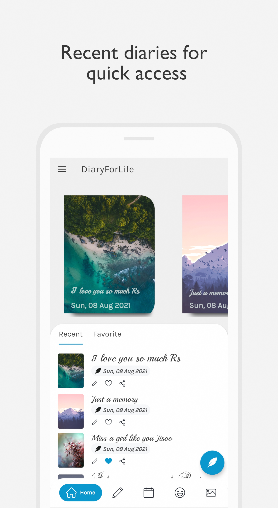
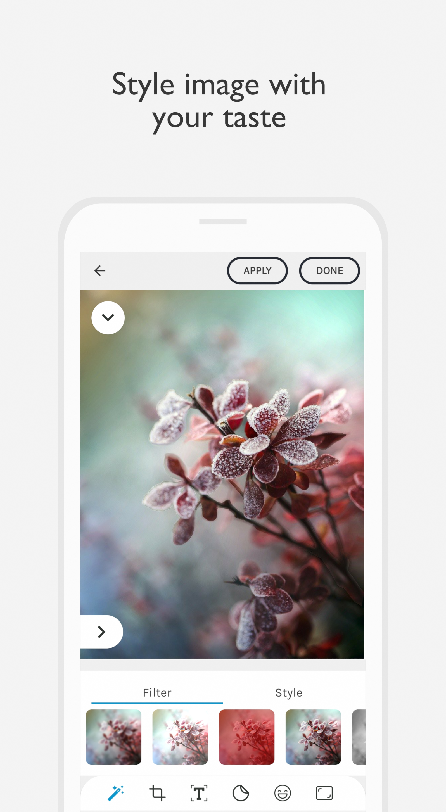
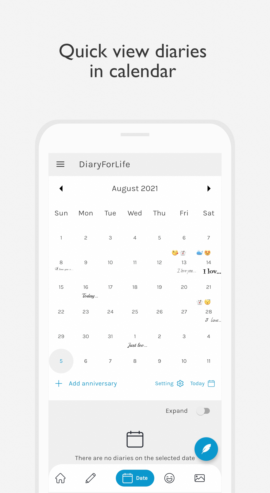
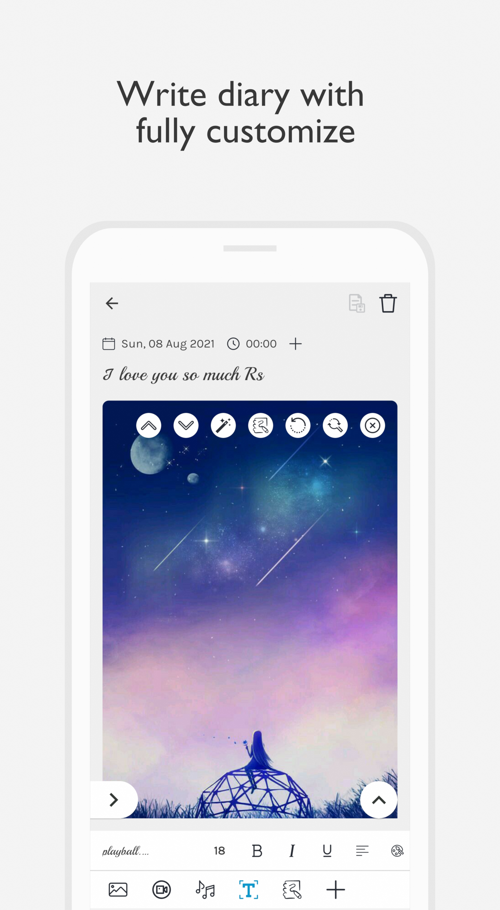
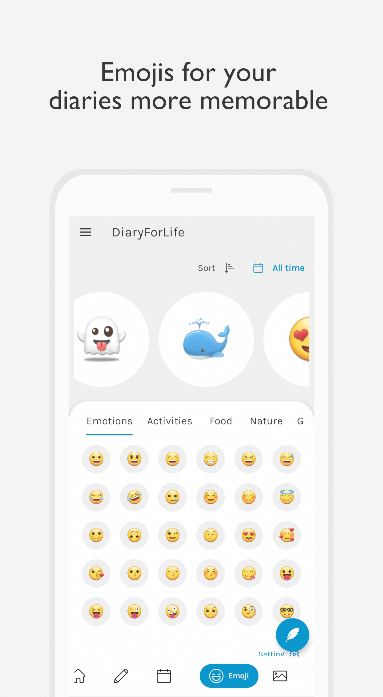
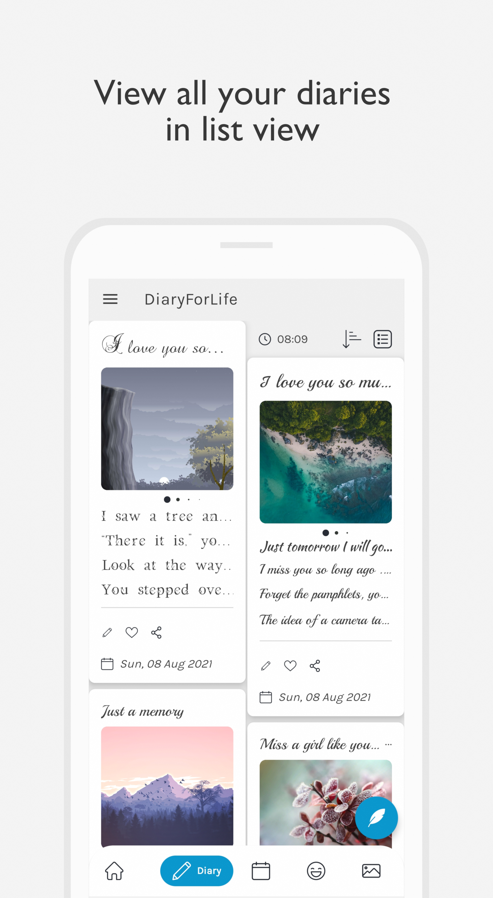
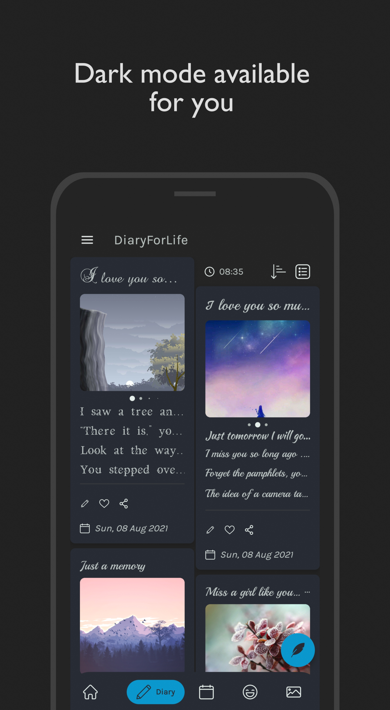
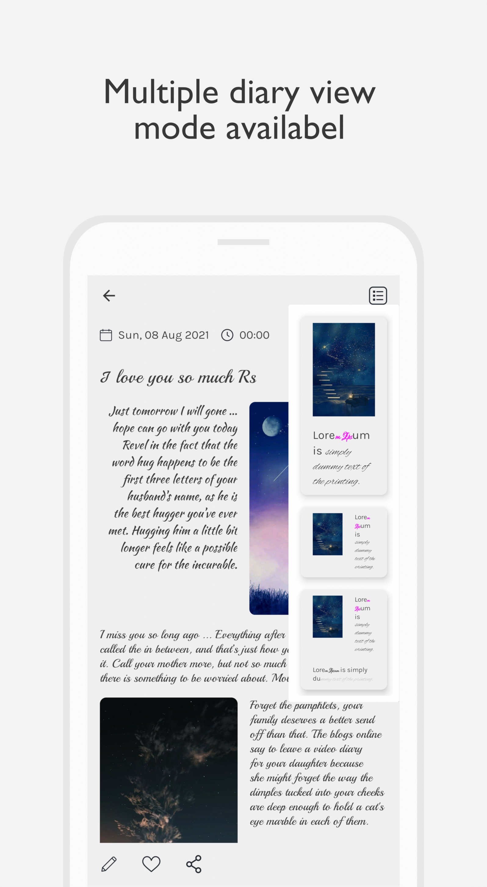

# DiaryForLife
Let take a peaceful moment and write down your feeling

## Showcases

|||||
|:-----------------------:|:-----------------------:|:-----------------------:|:-----------------------:|
|||||

## Description
Create your own personal diary

Diary is a free diary app.
You can use this diary app to write your personal diary of daily events, notes, express your feelings secrets with your own taste.
It's a fully customize diary app, which meant you can edit anything in your diary (text, images, title,...), even you can add video or audio as well as emoji to make your diary more vivid and awesome.

Free Photo Journal app. Diary is a Photo Journal diary app. You can write your diary with pictures, video, and audio to make your daily journal more memorable.
Edit your image inside the app with ease for customizing with your taste.

Features:
- Emojis via keyboard or in-app built-in
- Add your own images and style images with your taste
- Add videos from your device
- Add your favorite songs or audio
- Guidelines to help you use the app efficiently
- Easy to use (contain guides to help you use this app)
- Customize your text style (fonts, size, bold, italic, alignment, ...)
- Add diary to favorite list for easy view later
- More features coming soon ...

With the purpose of helping you write and save your note quickly and easily, but also make it presentable and beautiful to view.
The user interface is designed to be user-friendly with the guild lines to help you use the app most efficiently.
In this app, you not only can write your own notes, diaries but also edit the image, painting, or drawing with your finger and add to your diary with ease.

Emojis
If your phone has built-in emoji with your keyboard, you can use whatever emoji you want in anything (title, emotions as well as the content of the diary).
However, if your phone does not have an emoji feature you still can add emoji to your diary in the emotions section with emoji from the app.
